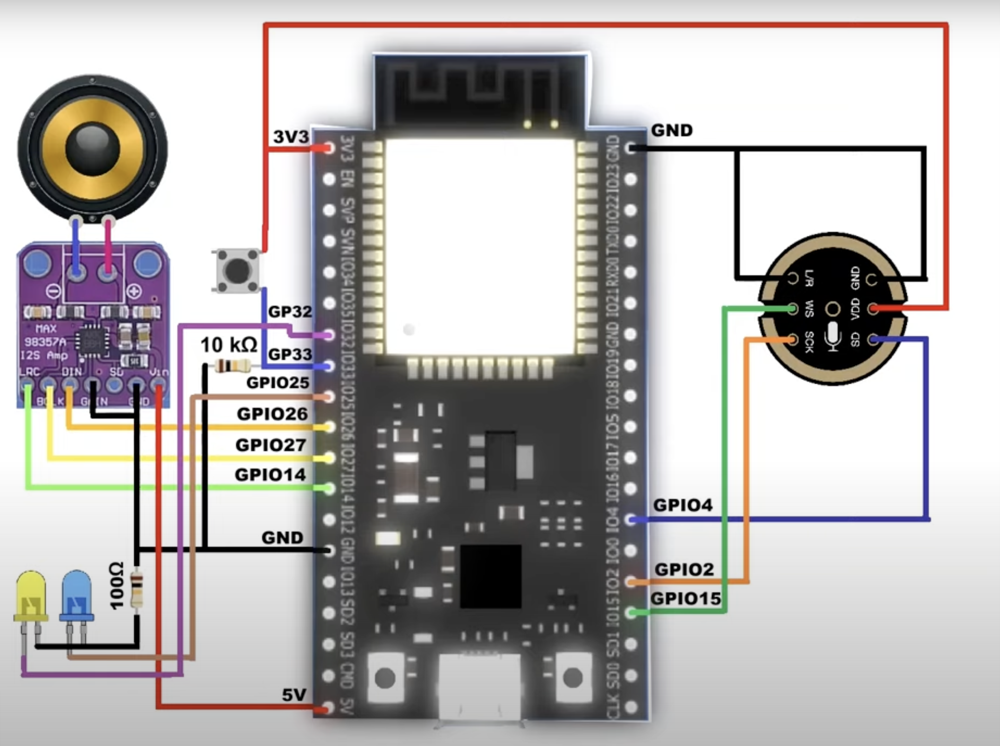

# Arduino Talking Bot with OpenAI API

This project demonstrates how to create an interactive Arduino bot that communicates with users using the OpenAI API. The bot listens to the user’s commands, processes the speech input, and responds with synthesized speech. It uses ESP32 and a microphone module for speech recognition, along with OpenAI's API for generating responses.

## Features
- **Wake-up Word Activation**: The bot can be activated with a specific wake-up phrase.
- **Speech Recognition**: The bot listens to the user's speech and converts it into text.
- **Chat with OpenAI**: The bot sends the speech text to OpenAI's API and retrieves a response.
- **Text-to-Speech**: The bot converts the OpenAI response into speech and plays it through a speaker.
- **LED Indicators**: The yellow LED indicates the bot is listening, while the blue LED indicates the bot is speaking.
- **Power Control**: A switch is used to turn the system on and off.

## Components Required
- **ESP32**: Main microcontroller for the project.
- **Microphone Module (e.g., I2S MEMS Microphone)**: For capturing audio input.
- **Speaker**: For playing the bot's responses.
- **LEDs (Yellow and Blue)**: For visual feedback (listening and speaking).
- **Switch**: To turn the bot system on/off.
- **WIFI Network**: Required for API communication.


## Pin Connections


## Circuit Diagram

Here is the circuit diagram of the Arduino bot that shows the connections:



### ESP32 Pinout:
- **LRC**: GPIO 14
- **BCLK**: GPIO 27
- **DIN**: GPIO 26
- **Yellow LED**: GPIO 32
- **Blue LED**: GPIO 25
- **Switch**: GPIO 33
- **MIC (Microphone)**:
  - **SD**: GPIO 14
  - **SCK**: GPIO 12
  - **WS**: GPIO 15

## How It Works

1. **Power On**: Press the switch to power on the bot. The bot will greet you with the message:  
   **"Hey, thanks for waking me up! Say 'Hello bot' to start interacting."**
   
2. **Wake-up Word**: Once you say "Hello bot", the bot will start listening to you. The yellow LED will turn on while it is listening.
   
3. **Speech-to-Text**: The bot captures your speech, converts it to text, and waits for a pause (4 seconds of silence) to stop listening.

4. **API Request**: After the user finishes speaking, the bot sends the text to OpenAI's API and fetches the response.

5. **Text-to-Speech**: The bot then converts the API's text response into speech and plays it through the speaker. The blue LED turns on during speaking, and the yellow LED turns off.

6. **Waiting for Wake-up**: Once the response is finished, the bot goes back to waiting for the wake-up word.

7. **Shutdown**: Press the switch again to turn off the system.

## Prerequisites

- **OpenAI API Key**: You must have an OpenAI API key. [Get it here](https://platform.openai.com/signup).
- **Wi-Fi Credentials**: Replace with your own Wi-Fi network name and password.

## Setup Instructions

### 1. Install Libraries
Ensure you have the necessary libraries installed in your Arduino IDE:
- `ESP32` by Espressif Systems
- `WiFi.h`
- `HTTPClient.h`
- `ArduinoJson.h`
- `SpeechRecognition.h` (for capturing speech)
- `TTS (Text-to-Speech) Library` (for generating audio from text)

### 2. Configuration
- **Wi-Fi Settings**: Replace `your_SSID` and `your_PASSWORD` with your actual Wi-Fi network credentials.
- **OpenAI API**: Replace `your_openai_api_key` with your actual API key obtained from OpenAI.

### 3. Code Customization

```cpp
#include <WiFi.h>
#include <HTTPClient.h>
#include <ArduinoJson.h>
#include <SpeechRecognition.h>  // Adjust according to your setup
#include <TTS.h>  // Replace with your TTS library

// WiFi credentials
const char* ssid = "your_SSID";
const char* password = "your_PASSWORD";

// OpenAI API key
const String apiKey = "your_openai_api_key";

// GPIO Pin Assignments
#define SWITCH_PIN 33
#define YELLOW_LED_PIN 32
#define BLUE_LED_PIN 25
#define MIC_PIN 34

void setup() {
  // Initialize Serial, WiFi, and LEDs
  Serial.begin(115200);
  pinMode(SWITCH_PIN, INPUT);
  pinMode(YELLOW_LED_PIN, OUTPUT);
  pinMode(BLUE_LED_PIN, OUTPUT);

  // Connect to WiFi
  WiFi.begin(ssid, password);
  while (WiFi.status() != WL_CONNECTED) {
    delay(1000);
    Serial.println("Connecting to WiFi...");
  }
  Serial.println("Connected to WiFi");

  // Wait for switch press to turn on the bot
  while(digitalRead(SWITCH_PIN) == LOW) {
    delay(100);
  }

  // Initial greeting
  speak("Hey, thanks for waking me up! Say 'Hello bot' to start interacting.");
}

void loop() {
  // Listen for wake-up word
  if (isWakeUpWordDetected()) {
    digitalWrite(YELLOW_LED_PIN, HIGH); // Turn on listening LED
    speak("Hello bot, I'm ready to listen.");
    String userSpeech = listenForSpeech(); // Function to capture and convert speech to text
    if (userSpeech.length() > 0) {
      String response = getResponseFromAPI(userSpeech);
      speak(response);  // Play the response through text-to-speech
    }
    digitalWrite(YELLOW_LED_PIN, LOW); // Turn off listening LED
  }

  // Check switch status for shutdown
  if (digitalRead(SWITCH_PIN) == HIGH) {
    turnOffBot();
  }
}

bool isWakeUpWordDetected() {
  // Replace this with actual wake-up word detection logic
  return true;  // Placeholder for wake-up word detection
}

String listenForSpeech() {
  // Placeholder for capturing and processing speech input
  String speech = "Sample user input";  // Replace with actual logic to process audio
  return speech;
}

String getResponseFromAPI(String userSpeech) {
  HTTPClient http;
  http.begin("https://api.openai.com/v1/chat/completions");
  http.addHeader("Content-Type", "application/json");
  http.addHeader("Authorization", "Bearer " + apiKey);

  // Build the request body
  String requestBody = "{\"model\": \"gpt-3.5-turbo\", \"messages\": [{\"role\": \"user\", \"content\": \"" + userSpeech + "\"}]}";

  // Send the request
  int httpCode = http.POST(requestBody);

  String response = "";
  if (httpCode == 200) {
    String payload = http.getString();
    DynamicJsonDocument doc(1024);
    deserializeJson(doc, payload);
    response = doc["choices"][0]["message"]["content"].as<String>();
  } else {
    response = "Error with the API request.";
  }

  http.end();
  return response;
}

void speak(String message) {
  // Placeholder for text-to-speech function
  Serial.println("Bot says: " + message);
  digitalWrite(BLUE_LED_PIN, HIGH); // Turn on speaking LED
  delay(2000); // Simulate speech delay
  digitalWrite(BLUE_LED_PIN, LOW); // Turn off speaking LED
}

void turnOffBot() {
  // Logic to power off the system (e.g., entering deep sleep mode)
  Serial.println("Turning off the bot.");
  // Add power off or deep sleep logic here
}
```

### 4. Upload Code
Upload the code to your ESP32 using the Arduino IDE.

### 5. Power On
Press the switch to power on the bot, and it will guide you through the interaction process.

## Troubleshooting

- **No Response**: Ensure the microphone is properly connected and placed close to the user.
- **API Errors**: Double-check your OpenAI API key and ensure the bot is connected to the internet.
- **Wi-Fi Issues**: Make sure the ESP32 is within range of your Wi-Fi network.

## Contributing
Feel free to fork this repository, open issues, or submit pull requests if you have suggestions for improvements or fixes.

